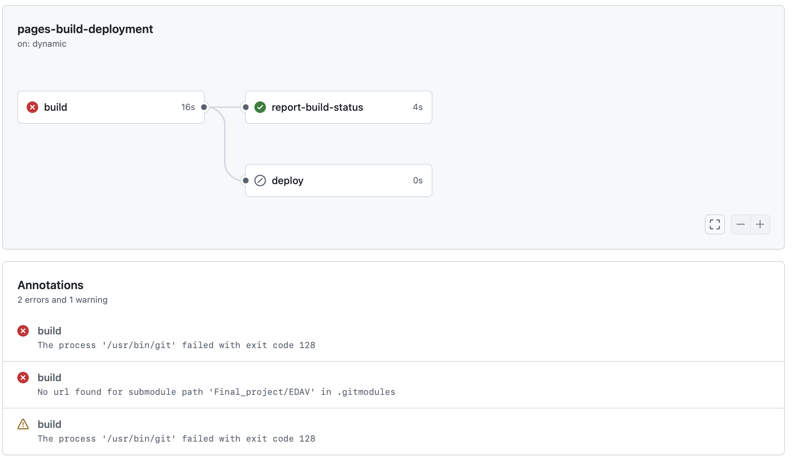

# The Relationship Between Health Conditions and Alcohol Consumption

## Overview

This project explores the intricate patterns and relationship between health conditions and alcohol consumption. With the growing pressures of modern life, many individuals turn to alcohol as a means of coping with physical and emotional stress. While this provide short-term relief, it can exacerbate health problems over time, leading to a vicious cycle.

By analyzing data and identifying patterns, this project aims to answer key questions: - Do people with chronic or mental health conditions exhibit different drinking behaviors compared to others? - Are there specific health conditions linked to higher alcohol consumption?

The goal is to provide actionable insights and strategies for supporting individuals dealing with both health issues and alcohol use, paving the way for better health interventions.

## Table of Contents

1.  **Introduction**
2.  **Data**
3.  **Results**
4.  **Interactive Graph**
5.  **Conclusion**

## Authors

-   **Yunyan Ouyang** ([Github link](https://github.com/yyouyang12))\
-   **Bosi Hou** ([Github link](https://github.com/bosihou))

## Published

First Published on Novemner 20. Moved to this repository on December 12, 2024

## Statement

Both of us in the group encountered this issue illustrated in the above graph. We moved all project contents from the old repository to the new one. The project has been completed based on the homework requirements.
